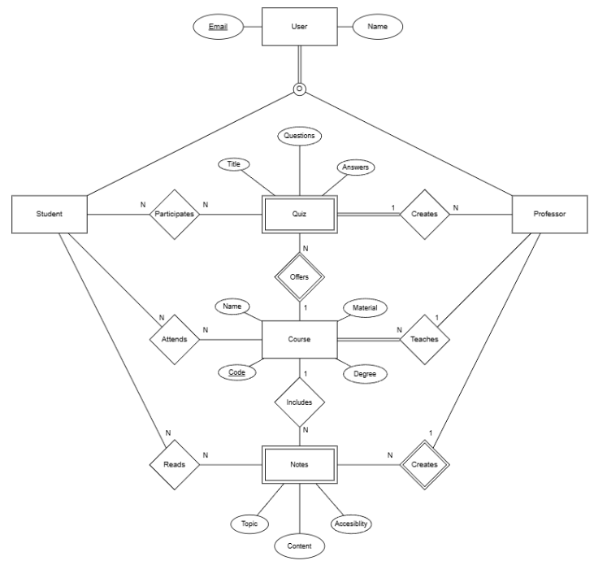

# Backend and Frontend Template

Latest version: https://git.chalmers.se/courses/dit342/group-00-web

This template refers to itself as `group-00-web`. In your project, use your group number in place of `00`.

## Project Structure

| File        | Purpose           | What you do?  |
| ------------- | ------------- | ----- |
| `server/` | Backend server code | All your server code |
| [server/README.md](server/README.md) | Everything about the server | **READ ME** carefully! |
| `client/` | Frontend client code | All your client code |
| [client/README.md](client/README.md) | Everything about the client | **READ ME** carefully! |
| [docs/LOCAL_DEPLOYMENT.md](docs/LOCAL_DEPLOYMENT.md) | Local production deployment | Deploy your app local in production mode |

## Requirements

The version numbers in brackets indicate the tested versions but feel free to use more recent versions.
You can also use alternative tools if you know how to configure them (e.g., Firefox instead of Chrome).

* [Git](https://git-scm.com/) (v2) => [installation instructions](https://www.atlassian.com/git/tutorials/install-git)
  * [Add your Git username and set your email](https://docs.github.com/en/get-started/git-basics/setting-your-username-in-git)
    * `git config --global user.name "YOUR_USERNAME"` => check `git config --global user.name`
    * `git config --global user.email "email@example.com"` => check `git config --global user.email`
  * > **Windows users**: We recommend to use the [Git Bash](https://www.atlassian.com/git/tutorials/git-bash) shell from your Git installation or the Bash shell from the [Windows Subsystem for Linux](https://docs.microsoft.com/en-us/windows/wsl/install-win10) to run all shell commands for this project.
* [Chalmers GitLab](https://git.chalmers.se/) => Login with your **Chalmers CID** choosing "Sign in with" **Chalmers Login**. (contact [support@chalmers.se](mailto:support@chalmers.se) if you don't have one)
  * DIT342 course group: https://git.chalmers.se/courses/dit342
  * [Setup SSH key with Gitlab](https://docs.gitlab.com/user/ssh/#generate-an-ssh-key-pair)
    * Create an SSH key pair `ssh-keygen -t ed25519 -C "email@example.com"` (skip if you already have one)
    * Add your public SSH key to your Gitlab profile under https://git.chalmers.se/-/user_settings/ssh_keys
    * Make sure the email you use to commit is registered under https://git.chalmers.se/-/profile/emails
  * Checkout the [Backend-Frontend](https://git.chalmers.se/courses/dit342/group-00-web) template `git clone git@git.chalmers.se:courses/dit342/group-00-web.git`
* [Server Requirements](./server/README.md#Requirements)
* [Client Requirements](./client/README.md#Requirements)

## Getting started

```bash
# Clone repository
git clone git@git.chalmers.se:courses/dit342/group-00-web.git

# Change into the directory
cd group-00-web

# Setup backend
cd server && npm install
npm run dev

# Setup frontend
cd client && npm install
npm run serve
```

> Check out the detailed instructions for [backend](./server/README.md) and [frontend](./client/README.md).

## Visual Studio Code (VSCode)

Open the `server` and `client` in separate VSCode workspaces or open the combined [backend-frontend.code-workspace](./backend-frontend.code-workspace). Otherwise, workspace-specific settings don't work properly.

## System Definition (MS0)

### Purpose

StudyBuddy is a full-stack web app that supports university learning and collaboration.

The backend provides a secure, role-aware REST API that stores and manages all academic data (users, courses, tasks, study groups, notes, and flashcards) in a (MongoDB). It handles user registration via admin-created codes, role assignment, validation, and relationship logic such as enrolments and memberships. The backend also ensures consistent CRUD behaviour.

The frontend is a responsive web client that uses this API and presents a clear interface. Students must be able to enroll in courses, view and complete tasks, create and share notes, and take quizzes. Teachers must be able to manage their courses and post materials. Admins can register new users. The UI must adapt to each user, driven by the API response as stated earlier. The interface adapts to each role and screen size and provides clear feedback and error handling.

These layers form a unified system:
- The frontend focuses on user experience, data presentation, and interaction.
- The backend ensures reliable data storage, validation, and business logic.


###Roles & Access

| Role        | Description           | Key Abilities |
| ------------- | ------------- | ----- |
| Admin | Oversees the plantform | Creates and monitors registration codes for teahcers and Students |
| Teacher | Manages academic content | Creates courses, tasks,study groups, and notes |
| Student | Main end-user | Enrols in courses, joins groups, studies flashcards and quizzes |


### Pages

| Page        | Description |
| ------------- | ------------- | 
| Login/Sign-Up | The enrty point for all users. Displays a login form and a registration form where new users activate their account using an admin provided registration code. Handles authenticaiton and redirects user to their role-specific dahsboard after successful login |
| Teacher Dahsboard | Displays all courses created by the logged-in teacher. Teachers can add, edit, or delete courses, create new tasks and study groups, and upload notes. Provodes quick links to manage cours eparticipants and materials.  |
| Student Dahsboard | Shows an overview of the student's enrolles courses, upcoming tasks, and flashcards due for review. Students can navifate directly to course details, create personal notes, adn track their study progress.  |
| Courses | Lists all available or enrolled courses depending on user role. Each course can be opened to view details such as description, tasks, notes, and related study groups. Teachers can create new courses; students can enrol or leave a course. |
| Course Details | Displays a course overview with tabs for Tasks, Notes, Study Groups, and People. Teachers can post or edit tasks and notes. Students can view assigned work, access shared notes, and join study groups. |
| Study Groups | Lists all study groups within a course. Students can join or leave groups; teachers can create or moderate them. Each group page shows members, group notes, and discussions related to the course. |
| Notes | Displays note content and optional AI-generated summaries. Students cna use the "Generate Flashcards" button to produce study cards from a note. |
| Flashcards & Quiz | Presents flashcards for interactive study sessions. Users flip cards to view answers and mark how difficult each card was. Includes a quiz mode that generates five short questions from notes to test understanding. |
| Tasks | Lists course tasks or assignments with status indicators. Teachers can create or update tasks; students can mark them complete. Tasks can be filtered or sorted by due date, label, or completion state. |
| Profile | Displays user information such as name, email, and role. Users can update personal details and change passwords. Provides logout functionality and optional preferences for study reminders. |
| Error/Empty States | Shown when a page has no content (e.g., “No courses found” or “No notes yet”) or when an invalid action occurs. Provides helpful guidance and navigation back to relevant sections. |
### Entity-Relationship (ER) Diagram



##Scope Clarification & Milesstoen Alignment
The ER model describes the full long-term vision of StudyBuddy.
However, for Milestone 1 (Backend) and Milestone 2 (Frontend), the team will focus on a subset of the total feature space to keep the scope realistic and aligned with course requirements.

The initial implementation prioritizes core entities and flows, while all other entities remain planned but not required for the first backend milestone.

This means:
- The ER represents the complete conceptual system, but
- MS1 will only implement the essential backend entities and relationships needed for CRUD and relationship endpoints, exactly as required by the checklist, and
- Additional functionality from the ER will be introduced gradually and only after the core system is stable.

## Advanced Feature: AI-Powered Study Tools

### Overview
As an advanced feature, our system provides **AI-powered study tools** that allow students to generate **summaries, quizzes, and flashcards** directly from course materials. This functionality integrates both backend processing and interactive frontend behavior, extending the system beyond standard CRUD operations.

The feature uses the OpenAI API (GPT-5 Nano) to process user-provided content and return **structured JSON responses**, ensuring predictable parsing, reliable storage, and consistent rendering in the frontend.

---

### Supported Content
Study tools can be generated from:

- **Text-based notes** created within the application  
- **PDF files** uploaded by teachers as course materials  

Teachers upload PDFs to courses, while students can view these materials and generate AI-based study aids without modifying the original files.

---

### Frontend Functionality
The advanced feature is directly exposed through the frontend interface:

- When viewing a **note**, students can generate:
  - A summary  
  - A quiz  
  - Flashcards
- When viewing a **PDF**, students can:
  - Open and read the PDF  
  - Generate the same AI-powered study tools from the document  

All generated content is displayed **dynamically on the same page without reloading**, providing immediate feedback and interaction. If no usable content is returned, the frontend shows a clear message instead of an empty result.

---

### Quiz Interaction Design
AI-generated quizzes are presented as interactive multiple-choice quizzes:

- Each quiz contains **multiple-choice questions**
- Every question has **four answer options**
- Only **one option** can be selected per question
- After selection:
  - Correct answers are highlighted in **green**
  - Incorrect selections are highlighted in **red**
  - The correct answer is shown immediately

Answer validation is handled **entirely on the frontend**. Since the backend returns both questions and correct answers in structured JSON, quiz results are shown instantly without additional API calls or page reloads.

---

### Backend Responsibilities
The backend supports this feature by:

- Sending structured prompts to the OpenAI API  
- Ensuring responses are returned in **valid JSON format**
- Extracting text from PDFs before AI processing
- Storing generated summaries, quizzes, and flashcards
- Exposing versioned REST endpoints used by the frontend  

Additional formatting and validation are applied where needed to ensure consistent and reliable data for frontend rendering.

---

### Justification as Advanced Functionality
This feature qualifies as advanced functionality because it:

- Integrates an **external AI service**
- Requires **non-trivial backend processing** (prompt design, PDF text extraction, structured responses)
- Provides **interactive frontend behavior** with immediate user feedback
- Extends the system beyond standard entity-based CRUD operations  

The feature aligns with the system’s educational purpose and demonstrates a deeper understanding of full-stack web application development.
