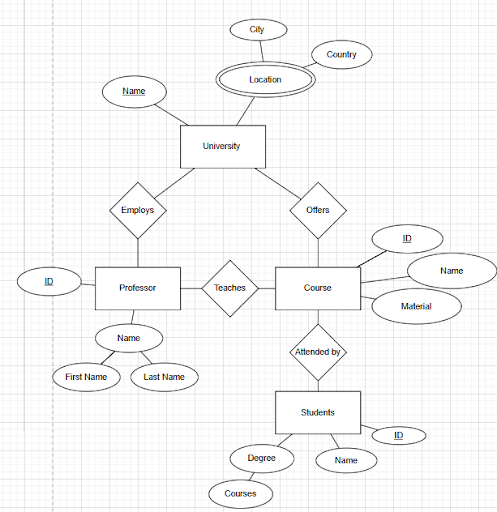

## System Definition (MS0)

### Purpose

StudyBuddy is a full-stack web app that supports university learning and collaboration.

The backend provides a secure, role-aware REST API that stores and manages all academic data (users, courses, tasks, study groups, notes, and flashcards) in a database. It handles user registration via admin-created codes, role assignment, validation, and relationship logic such as enrolments and memberships. The backend also ensures consistent CRUD behaviour.

The frontend is a responsive web client that uses this API and presents a clear interface. Students must be able to enroll in courses, view and complete tasks, create and share notes, and take quizzes. Teachers must be able to manage their courses and post materials. Admins can register new users. The UI must adapt to each user, driven by the API response as stated earlier.

These layers form a unified system:
- The frontend focuses on user experience, data presentation, and interaction.
- The backend ensures reliable data storage, validation, and business logic.

### Entity-Relationship (ER) Diagram

